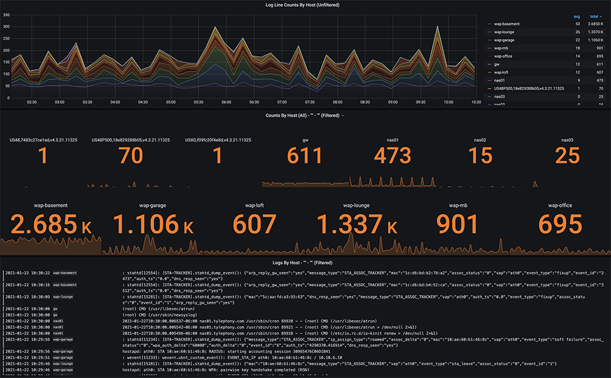

# Grafana Loki Syslog All-In-One (AIO)

## 🏗️ Architektur & Datenfluss

Der Stack ist so konzipiert, dass er als zentraler Log-Server fungiert. Er verarbeitet Daten in einer mehrstufigen Pipeline:

1.  **Ingest:** `syslog-ng` lauscht auf Port `2514` (UDP) für eingehende Syslog-Nachrichten.
2.  **Processing:** `syslog-ng` formatiert die Daten und leitet sie an **Grafana Alloy** (Port `1514`) weiter.
3.  **Aggregation:** Alloy (der Nachfolger von Promtail) taggt die Logs und sendet sie an **Loki**.
4.  **Storage:** Loki speichert die Logs entweder hochverfügbar in einem **MinIO S3-Bucket** oder lokal im Dateisystem.
5.  **Visualization:** **Grafana** dient als Frontend mit vorkonfigurierten Dashboards.

### Komplette Tool-Chain:
> **RFC3164 Devices** -> `syslog-ng` (UDP/2514) -> **Alloy** (UDP/1514) -> **Loki** (Port 3100)
>
> **Zusätzliches Monitoring:**
> *   **Prometheus:** Metriken-Speicher (Port 9090)
> *   **Alertmanager:** Alarmierung (Port 9093)
> *   **Tempo / Pyroscope:** Tracing und Profiling (Ports 3200 / 4040)
> *   **Blackbox-Exporter:** Endpunkt-Monitoring (Port 9115)



---

## 🚀 Installation & Start

Das Projekt wurde auf **Rocky Linux 9.5** getestet, läuft aber auf jedem System mit Docker & Docker Compose.

### 1. Repository vorbereiten

```bash
git clone https://github.com/alexander-heimbuch/github_os-aa-grafana-loki-syslog-aio.git
cd github_os-aa-grafana-loki-syslog-aio
```


### 2. Stack wählen und starten
Wähle die passende Konfiguration für deine Umgebung:

| Befehl | Fokus | Komponenten |
| :--- | :--- | :--- |
| `docker-compose up -d` | **Standard (Full)** | Alles inkl. Tracing, MinIO & Monitoring. |
| `docker-compose -f docker-compose-filesystem.yml up -d` | **Einfachheit** | Nutzt lokales Dateisystem statt MinIO. |
| `docker-compose -f docker-compose-with-generator.yml up -d` | **Demo/Test** | Inkl. Syslog-Generator für sofortige Testdaten. |
| `docker-compose -f docker-compose-without-monitoring.yml up -d` | **Ressourcensparend** | Nur Logging (Loki, Grafana, Alloy, syslog-ng). |

---

## ⚙️ Technische Details & Konfiguration

### Grafana Zugriff
*   **URL:** `http://<dein-server-ip>:3000`
*   **Login:** Deaktiviert (Anonymous Access mit Admin-Rechten vorkonfiguriert).
*   **Sicherheit:** Um den Zugriff einzuschränken, ändere in der `docker-compose.yml`:
    ```yaml
    GF_AUTH_ANONYMOUS_ORG_ROLE: Viewer
    ```

### Syslog-NG Konfiguration (`/config`)
Der `syslog-ng` Container fungiert als Brücke. Er nimmt Legacy-UDP-Pakete an und wandelt sie in einen Stream für Alloy um:
```syslog
destination d_loki {
    syslog("alloy" transport("udp") port("1514"));
};
```

### Loki & MinIO (S3 Storage)
Standardmäßig nutzt Loki MinIO. Die Keys sind vorkonfiguriert:
- Access Key: minio123
- Secret Key: minio456 

Falls du diese änderst, müssen sie sowohl in der docker-compose.yml als auch in der ./config/loki-config-s3.yml angepasst werden.

### Testdaten-Generator
Der enthaltene Generator (basiert auf random-logger) erzeugt künstliche Logs mit verschiedenen Prioritäten (INFO, WARN, ERROR). Dies ist ideal, um die Filterfunktionen in Grafana zu testen, ohne echte Hardware anbinden zu müssen.

## 🛠️ Fehlerbehebung (Troubleshooting)
- Keine Logs sichtbar? Prüfe, ob die Container laufen: `docker compose ps`
- Port-Konflikte? Stelle sicher, dass Port 514 (oder 2514) nicht bereits von einem lokalen Syslog-Dienst des Host-Systems belegt ist.
- Logs einsehen: `docker compose logs -f alloy` (um zu sehen, ob Daten bei Alloy ankommen).

## 🤝 Contributing & Kontakt
Beiträge zur Modernisierung oder neue Dashboards sind sehr willkommen!
1. Forke das Projekt.
2. Erstelle einen Feature Branch (`git checkout -b feature/loki-tuning`).
3. Commit & Push.
4. Öffne einen Pull Request.
#### Kontakt:
Maintainer: André Wolff (@awo) - andre[at]auge02.de
Projekt: GitHub Repository

### Acknowledgements
- Grafana Labs (Loki, Alloy, Grafana)
- syslog-ng
- Vicente Zepeda Mas (Random Logger)

### Was ist neu in dieser Version?
*   **Detaillierter Datenfluss:** Die Schritte von der Quelle bis zur Visualisierung sind klar benannt.
*   **Konfigurations-Snippets:** Wichtige Details zu Ports und Storage-Keys sind direkt im README sichtbar.
*   **Troubleshooting-Sektion:** Kurze Hilfe für den Fall, dass es nicht sofort läuft.
*   **Bessere Formatierung:** Tabellen und Code-Blöcke machen die verschiedenen `docker-compose` Optionen übersichtlicher.
